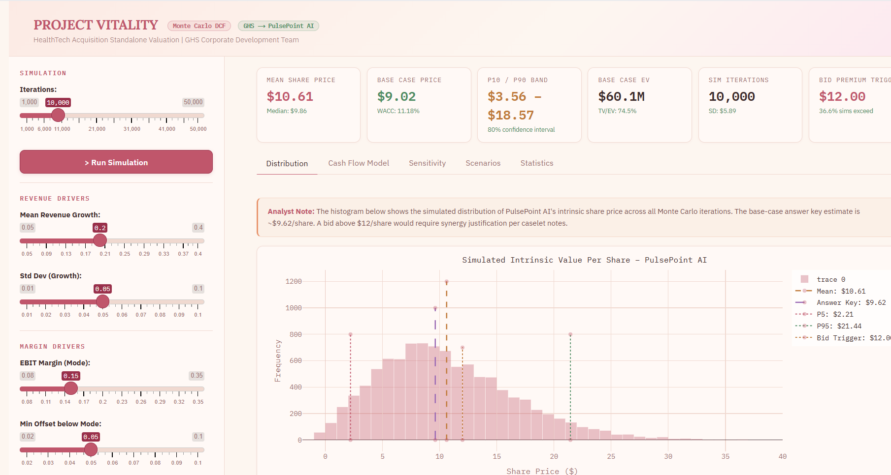

# Project-Vitality
The Project implement Monte Carlo simulation model for financial valuation and risk analysis. The model runs 10000 of simulations by varying key assumptions such as growth rate, discount rate, and cash flows to estimate a range of possible valuation outcomes. Helps analyze uncertainty and make more informed investment or M&amp;A decisions.
#Simulation Output

